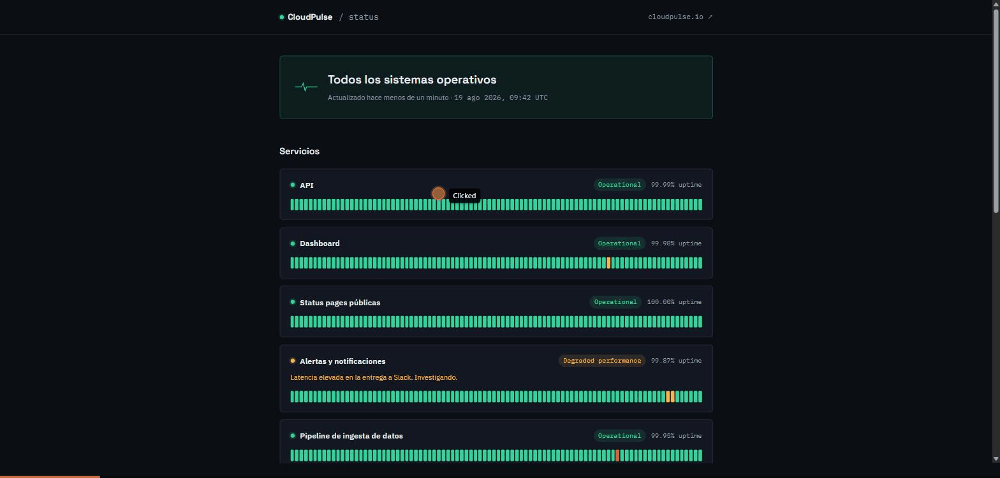

# 🏗️ CloudPulse — ECS Multi-Servicio (EC2 + Fargate) con Path-Based Routing


Arquitectura de contenedores **Docker** en AWS con **Amazon ECS de tipos de
lanzamiento mixtos (EC2 + Fargate)**, un **Application Load Balancer** con
enrutamiento basado en rutas, autoescalado a dos niveles (servicio e
infraestructura) y observabilidad con **CloudWatch** — todo definido con
**Terraform** y desplegado de forma 100% automatizada con **GitHub
Actions**. Ningún paso se ejecuta manualmente en la consola de AWS.

Incluye una app de ejemplo completa: **CloudPulse**, una plataforma SaaS
ficticia de monitorización de infraestructura, dividida en 3 microservicios
independientes que ilustran el path-based routing de forma realista.



---

## 📦 Qué incluye

- ☁️ **Infraestructura Terraform modular** — VPC, security groups, ECR,
  ECS (cluster + task definitions + services), ALB, ACM, Route 53 y
  CloudWatch, en 10 módulos independientes.
- 🐳 **3 microservicios de ejemplo** completos y desacoplados de la
  infraestructura (`web`, `status`, `docs`) — cada uno con su propio
  `Dockerfile`, contenedores Nginx sirviendo contenido estático, listos
  para sustituir.
- ⚖️ **ECS con tipos de lanzamiento mixtos** — `web` y `status` sobre EC2
  (Capacity Provider con Auto Scaling Group), `docs` sobre Fargate.
- 📈 **Autoescalado en dos niveles** — target tracking por servicio
  (`ALBRequestCountPerTarget`) y Managed Scaling del Capacity Provider EC2.
- 🔐 **Buenas prácticas de seguridad** — security groups en capas (el ALB
  es el único punto expuesto a internet), ECR con `scanOnPush` y tags
  inmutables, TLS forzado en el ALB.
- 🔁 **CI/CD con GitHub Actions + OIDC** — build de las 3 imágenes, push a
  ECR, `terraform apply` y `force-new-deployment`, sin credenciales
  estáticas.
- 🧩 **Backend remoto de Terraform (S3 + DynamoDB)** aislado en su propio
  paso de bootstrap.

---

## 🗺️ Arquitectura

```
Usuarios → Route 53 (DNS) → ALB (HTTPS, path-based routing)
                                  │
                  ┌───────────────┼───────────────┐
                  │               │               │
            /  (default)      /status*         /docs*
                  │               │               │
            service-web    service-status   service-docs
             (EC2)           (EC2)            (Fargate)
                  │               │               │
                    Cluster ECS (subredes privadas)
                                  │
            ECR (web, status, docs) ← imágenes Docker (CI/CD)
                                  │
              CloudWatch (Logs + Container Insights + Alarmas)
```

| Servicio | Función |
|---|---|
| 🌐 **Route 53** | Gestión del dominio y resolución DNS, registro Alias hacia el ALB |
| ⚖️ **Application Load Balancer** | Único punto de entrada público, HTTPS, enrutamiento por path (`/`, `/status*`, `/docs*`) |
| 🐳 **Amazon ECS** | Cluster con Capacity Providers mixtos — EC2 (`web`, `status`) y Fargate (`docs`) |
| 📦 **ECR** | 3 repositorios privados de imágenes Docker, uno por microservicio |
| 🔒 **ACM** | Emisión y validación (mediante DNS) del certificado SSL usado por el ALB |
| 📊 **CloudWatch** | Logs por servicio, Container Insights a nivel de cluster, alarmas de CPU/memoria |

### Seguridad por defecto

- 🛡️ `ECSInstanceSG` solo acepta tráfico desde `ALBSG` — los contenedores
  nunca son directamente accesibles desde internet.
- 🔐 Listener HTTP (80) del ALB redirige forzosamente a HTTPS (443).
- 📦 ECR con `scanOnPush`, tags inmutables (`IMMUTABLE`) y lifecycle policy
  (retiene solo las últimas 10 imágenes por repositorio).
- 🔑 Certificado ACM validado por DNS, automatizado por Terraform.
- 🗄️ Remote state de Terraform en S3 (cifrado, versionado, sin acceso
  público) con locking en DynamoDB.
- 🚪 Acceso SSH a las instancias EC2 desactivado por defecto (security
  group `WorkstationSG` opcional, nunca abierto a `0.0.0.0/0`).

---

## 📁 Estructura del repositorio

```
docker-ecs-fargate-ec2/
├── infrastructure/            # 🌍 Terraform: módulos, environment y bootstrap del backend remoto
│   ├── bootstrap/
│   ├── environments/prod/
│   └── modules/
│       ├── vpc/
│       ├── security-groups/
│       ├── ecr/
│       ├── ecs-cluster/
│       ├── ecs-task-definitions/
│       ├── ecs-services/
│       ├── alb/
│       ├── acm-certificate/
│       ├── route53/
│       └── cloudwatch/
├── apps/                       # 🐳 Microservicios de ejemplo (sustituibles)
│   ├── web/                    #    Landing page — EC2
│   ├── status/                 #    Status page — EC2
│   └── docs/                   #    Portal de documentación — Fargate
└── .github/
    └── workflows/deploy.yml     # 🔁 CI/CD: build + push a ECR + terraform apply + force-new-deployment
```

`infrastructure/` y `apps/` están completamente desacopladas: puedes
sustituir cualquiera de los 3 microservicios (o añadir uno nuevo) sin tocar
Terraform, siempre que expongas el contenido en el puerto 80 dentro de un
contenedor Nginx. Ver [`infrastructure/README.md`](infrastructure/README.md)
para el detalle de cómo conectar un servicio nuevo al ALB.

**Estado actual**: la infraestructura Terraform (10 módulos + environment
`prod`), los 3 microservicios de ejemplo y el workflow de CI/CD ya están
completos.

---

## 🚀 Cómo desplegar

1. **Bootstrap del backend remoto** — crea el bucket S3 y la tabla DynamoDB
   para el state de Terraform (`infrastructure/bootstrap`).
2. **Rol IAM para GitHub Actions (OIDC)** — se crea una única vez, fuera de
   Terraform (ver [`infrastructure/OIDC-SETUP.md`](infrastructure/OIDC-SETUP.md)).
3. **Desplegar infraestructura** — `terraform init / plan / apply` sobre
   `infrastructure/environments/prod`.
4. **Build de las 3 apps y push a ECR** — manual o, normalmente, a través
   del workflow de GitHub Actions.
5. **Force new deployment** — los 3 servicios ECS recogen la imagen recién
   publicada.

Instrucciones detalladas paso a paso en
[`infrastructure/README.md`](infrastructure/README.md).

### Secrets y variables de GitHub

| Nombre | Tipo | Descripción |
|---|---|---|
| `AWS_ROLE_ARN` | Secret | ARN del rol IAM asumido mediante OIDC |
| `DOMAIN_NAME` | Variable | Dominio real de la app (si no se define, se usa `cloudpulse.example.com`) |

---

## 🔁 CI/CD

Workflow único ([`.github/workflows/deploy.yml`](.github/workflows/deploy.yml)),
con 3 jobs encadenados. Por defecto solo se dispara manualmente
(`workflow_dispatch`) — el trigger automático en push a `main` está
comentado en el propio archivo, listo para activar cuando exista el rol
OIDC y el secret `AWS_ROLE_ARN`:

1. **`build-and-push`** (matrix `web` / `status` / `docs`, en paralelo) —
   build de cada imagen y push a ECR con tag `latest` + SHA del commit.
2. **`deploy-infrastructure`** — `terraform init / plan / apply` sobre
   `infrastructure/environments/prod`.
3. **`force-new-deployment`** — `aws ecs update-service
   --force-new-deployment` en los 3 servicios.

Autenticación 100% mediante **OIDC**, sin credenciales estáticas almacenadas
como secreto.

<details>
<summary>Equivalente manual (solo referencia educativa)</summary>

```bash
# 1. Build y push de una imagen a ECR
docker build -t web ./apps/web
docker tag web:latest <account_id>.dkr.ecr.us-east-1.amazonaws.com/web:latest
aws ecr get-login-password --region us-east-1 \
  | docker login --username AWS --password-stdin <account_id>.dkr.ecr.us-east-1.amazonaws.com
docker push <account_id>.dkr.ecr.us-east-1.amazonaws.com/web:latest

# 2. Aplicar infraestructura
cd infrastructure/environments/prod
terraform init && terraform plan && terraform apply

# 3. Forzar que el servicio recoja la nueva imagen
aws ecs update-service --cluster cloudpulse-cluster --service web --force-new-deployment
```

No es el flujo real de uso del repositorio, pensado para dispararse desde
el propio pipeline.
</details>

---

## 🧱 Stack

**Infraestructura**: Terraform · AWS (VPC, ECS, EC2, Fargate, ALB, ECR,
ACM, Route 53, CloudWatch, S3, DynamoDB)
**Apps de ejemplo**: HTML · CSS · JS (sin frameworks) · Docker · Nginx
**CI/CD**: GitHub Actions · OIDC (sin credenciales estáticas)

---

## 📫 Más información

- [`infrastructure/README.md`](infrastructure/README.md) — despliegue paso
  a paso de la infraestructura, orden de aplicación de los módulos.
- [`infrastructure/OIDC-SETUP.md`](infrastructure/OIDC-SETUP.md) — crear el
  rol IAM OIDC para GitHub Actions, con CLI o consola.

---

## Fuera de alcance

Bases de datos, WAF/Shield/GuardDuty, Service Mesh, librerías de
visualización de datos en `status` (deliberado, para no solapar con otros
proyectos del portfolio) y múltiples entornos activos simultáneamente (la
estructura admite `dev`/`staging` mediante `environments/`, pero solo se
despliega `prod` por defecto).

## Licencia

[MIT](LICENSE)
